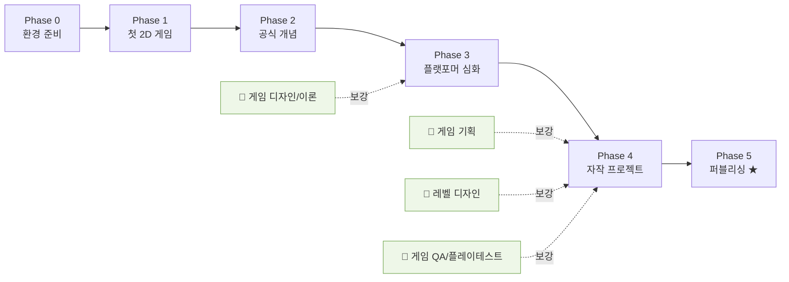

# 학습 로드맵

> ## 🎯 북극성
> **대학 졸업 스타트업 수준으로 2D 횡스크롤 플랫포머를 개발하고, 직접 퍼블리싱(출시)하는 경험을 갖는다.**
> 학습의 모든 단계는 "출시 가능한 게임 한 편"으로 수렴한다. 완벽한 이해보다 *완성과 출시*가 우선.

상태 범례: ✅ 배움 · 🟡 배우는 중 · ⬜ 배울 예정 · 🌿 가지치기(필요할 때 보강)

자세한 자료는 [resources.md](resources.md), 메인 줄기 상세 체크리스트는 [learning-plan.md](learning-plan.md) 참고.

---

## 전체 흐름

---

## 메인 줄기 (Godot 개발)

### Phase 0 — 환경 준비
- ✅ GitHub 레포 + 학습 로드맵 + 대시보드 세팅
- ✅ Godot 4.7 설치(macOS Apple Silicon), 에디터·노드/씬/시그널 개념 적응

### Phase 1 — 공식 튜토리얼: 첫 2D 게임 (Dodge the Creeps) ✅
- ✅ 프로젝트 설정 + 에셋 가져오기
- ✅ 플레이어 씬 (이동·애니메이션)
- ✅ 적(Mob) 씬 + 인스턴스 생성
- ✅ 메인 씬 조립 + 스폰 타이머
- ✅ HUD(점수·메시지) + 시그널 연결
- ✅ 게임오버(그룹 일괄 제거)·실행 (사운드는 생략)

> 노드·씬·**시그널·인스턴스**·UI를 한 바퀴 도는 공식 무료 튜토리얼. 책 없이 진행하며 튜터가 전 과정을 가이드. (책 『고도 엔진 4』는 선택적 보조)

### Phase 2 — 공식 문서 개념 정리 (Step by step)
- ⬜ 노드/씬 · 인스턴스 · 스크립트 · 입력 · 시그널 개념 탄탄히
- ⬜ (선택) 첫 3D 게임 Squash the Creeps 가볍게

### Phase 3 — 플랫포머 심화
- ⬜ 이동·물리(CharacterBody2D), 타일맵, 카메라, 애니메이션 상태머신, 적 AI

### Phase 4 — 자작 2D 횡스크롤 플랫포머
- ⬜ 기획 → 프로토타입 → 콘텐츠 → 폴리시 → 마무리

### Phase 5 — 퍼블리싱 ★ (최종 목표)
- ⬜ 빌드/익스포트(클린 빌드, 내 PC 아닌 곳에서 실행 확인)
- ⬜ itch.io 페이지 제작 + 데모/무료 출시 → 피드백 수집
- ⬜ (선택) Steam Direct 등록($100), 스토어 페이지, 위시리스트, Next Fest 데모
- ⬜ 출시 후: 버그 대응, 피드백 반영, devlog

---

## 가지치기 트랙 (인접 분야 — 필요할 때 보강) 🌿

메인을 진행하다 모르는 개념이 나오면 해당 트랙에서 자료를 골라 채운다. 자료는 [resources.md](resources.md).

| 트랙 | 언제 보강하나 | 상태 | 핵심 첫 자료 |
|------|--------------|------|-------------|
| 게임 기획 | Phase 4 시작 전(무엇을 만들지 정할 때) | ⬜ | GDD 입문 + Vertical Slice |
| 게임 디자인/이론 | Phase 3(점프감·재미가 안 날 때) | ⬜ | GMTK *Secrets of Game Feel and Juice* |
| 레벨 디자인 | Phase 4(스테이지 만들 때) | ⬜ | GMTK *Mario 3D World 4 Step* |
| 게임 QA/플레이테스트 | Phase 4 폴리시 ~ Phase 5 출시 전 | ⬜ | 플레이테스트 6대 질문 + 버그 리포트 양식 |

---

## 가지치기 백로그 (모르는 것 발견 시 추가)

학습 중 모르는 용어·개념이 나오면 여기에 적고, 보강하면 상태를 갱신한다.

| 발견한 모르는 것 | 분야 | 상태 | 메모/자료 |
|-----------------|------|------|----------|
| _(예) 코요테 타임이 뭐지?_ | 게임 디자인 | ⬜ | GMTK Celeste 영상 |
|  |  |  |  |

---

## 배운 것 로그 (완료 기록)

끝낸 항목을 날짜와 함께 한 줄로 남긴다. "무엇을 만들 수 있게 됐나" 중심.

- 2026-06-21 — 레포/로드맵/대시보드 세팅 완료
- 2026-06-21 — Phase 0 완료: Godot 4.7 설치, 에디터·노드/씬/트리/시그널 개념, 첫 씬 제작·저장
- 2026-06-21 — Phase 1 완료: Dodge the Creeps 제작 — 씬·인스턴스·시그널·그룹·타이머·물리(RigidBody2D/Area2D·충돌 레이어)·UI(CanvasLayer). 사운드는 생략
